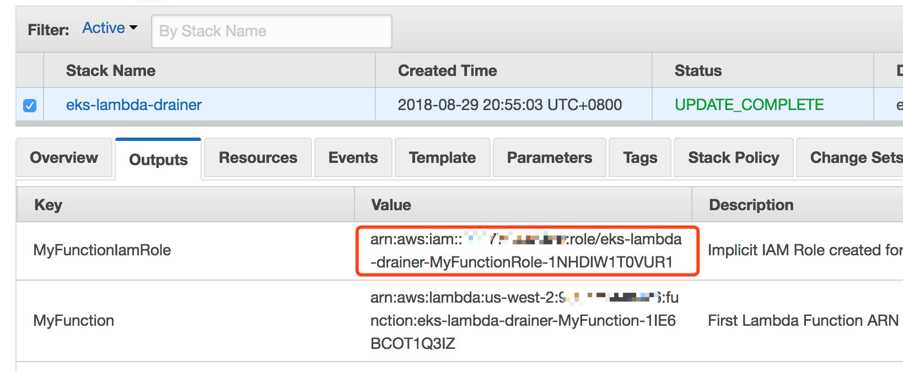

# eks-lambda-drainer

**eks-lambda-drainer** is an Amazon EKS node drainer with AWS Lambda. If you provision spot instances or spotfleet in your Amazon EKS nodegroup, you can listen to the spot termination signal from **CloudWatch Events** 120 seconds in prior to the final termination process. By configuring this Lambda function as the CloudWatch Event target, **eks-lambda-drainer**  will perform the taint-based eviction on the terminating node and all the pods without relative toleration will be evicted and rescheduled to another node - your workload will get very minimal impact on the spot instance termination.


# Installation

Install [SAM CLI](https://github.com/awslabs/aws-sam-cli) and [go dep](https://golang.github.io/dep/docs/installation.html)

1. execute `dep ensure -v`to make sure all packages required can be downloaded to local
2. just type `make` to buiild the `main.zip` for Lambda
3. `sam package` to package the lambda bundle
4. `sam deploy` to deploy to AWS Lambda 

# Add Lambda Role into ConfigMap

Read Amazon EKS [document](https://docs.aws.amazon.com/eks/latest/userguide/add-user-role.html) about how to add an IAM Role to the `aws-auth` ConfigMap. 

Edit the `aws-auth` ConfigMap by 

```
kubectl edit -n kube-system configmap/aws-auth
```

And insert `rolearn`, `groups` and `username` into the `mapRoles`, make sure the groups contain `system:masters`


You can get the `rolearn` from the output tab of cloudformation console.




# In Actions


try `kubectl describe` this node and see the `Taints` on it


# TODO

- [ ] package the Lambda function in [AWS SAM](https://docs.aws.amazon.com/lambda/latest/dg/serverless_app.html) format
- [ ] publish to [AWS Serverless Applicaton Repository](https://aws.amazon.com/tw/serverless/serverlessrepo/)
- [ ] ASG/LifeCycle integration [#2](https://github.com/pahud/eks-lambda-drainer/issues/2)
- [ ] add more samples
